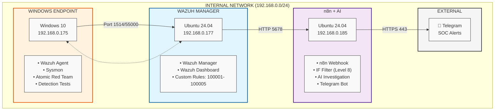

## Network Architecture Overview

**Note**: Kali Linux will be implemented in a future phase as part of a dedicated penetration testing project.

## VM Resource Summary

| VM               | IP Address    | RAM | CPU Cores | Storage | Status  | Purpose             |
|------------------|---------------|-----|-----------|---------|---------|---------------------|
| Wazuh Manager    | 192.168.0.177 | 8GB | 2 cores   | 50GB    | Active  | SIEM + Detection    |
| Windows Endpoint | 192.168.0.175 | 8GB | 2 cores   | 120GB   | Active  | Telemetry + Testing |
| n8n+TheHive      | 192.168.0.185 | 8GB | 2 cores   | 50GB    | Active  | SOAR + AI Analysis + Telegram       |
| Kali Linux       | TBD          | 8GB | 2 cores       | 60GB     | Planned | Penetration Testing Project     |

## Network Communication

| Source | Destination | Port | Protocol | Purpose |
|--------|-------------|------|----------|---------|
| Windows (192.168.0.175) | Wazuh (192.168.0.177) | 1514 | TCP/UDP | Agent connection (event forwarding) |
| Windows (192.168.0.175) | Wazuh (192.168.0.177) | 55000 | TCP | 	Agent enrollment/registration |
| Wazuh (192.168.0.177) | n8n (192.168.0.185) | 5678 | HTTP | 	Webhook alerts (JSON payload) |
| n8n (192.168.0.185) | DeepSeek API | 443 | HTTPS | AI analysis for alert triage |
| n8n (192.168.0.185) | Telegram API | 443 | HTTPS | Instant notifications to SOC channel |

## Active Detection Rules (MITRE ATT&CK Mapped)

| Rule ID | MITRE Tactic | MITRE Technique | Description | Alert Level |
|---------|--------------|-----------------|-------------|-------|
| **100001** | Execution (TA0002) | T1059.001 | Detects encoded/obfuscated PowerShell commands | 8 (High) |
| **100002** | Credential Access (TA0006) | T1003.001 | Detects Mimikatz/LSASS process access attempts | 14 (Critical) |
| **100003** | Defense Evasion (TA0005) | T1562.001 | Detects attempts to disable Windows Defender | 12 (Critical) |
| **100004** | Persistence (TA0003) | T1053.005 | Detects unauthorized scheduled task creation | 8 (High) |
| **100005** | Command & Control (TA0011) | T1095 | Detects suspicious C2 communication patterns | 12 (Critical) |

